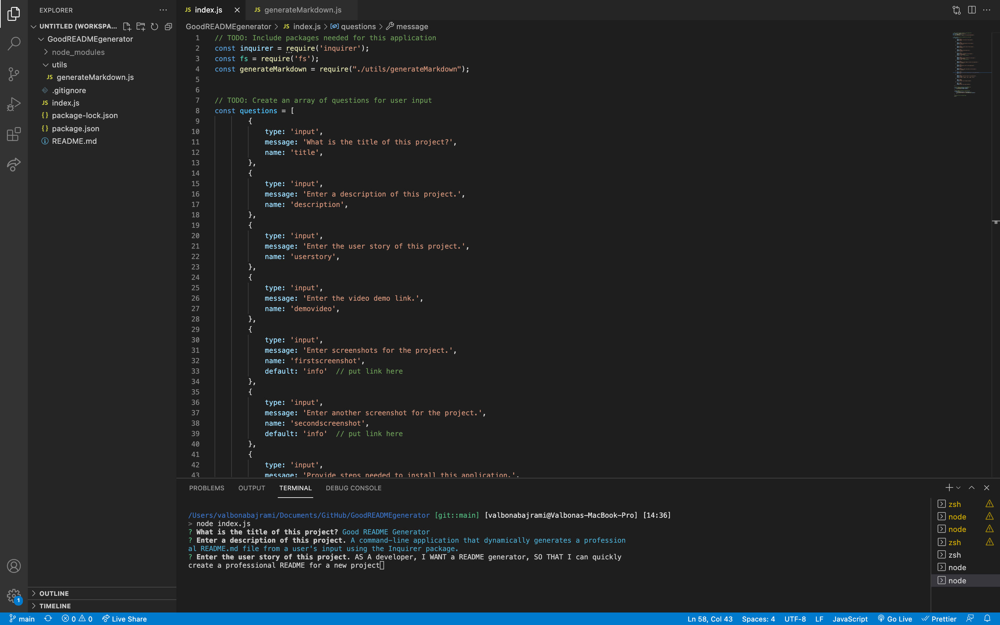
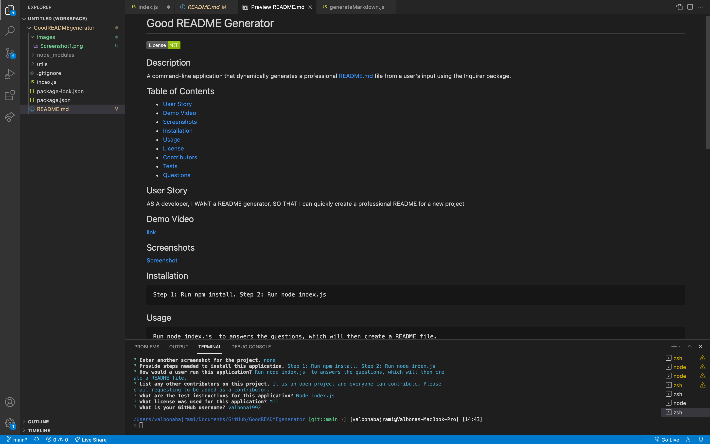

  #   <br/>
  
  
  ## Description
  
  
  ## Table of Contents 
  
  * [User Story](#userstory)
  * [Demo Video](#demovideo)
  * [Screenshots](#screenshots)
  * [Installation](#installation)
  * [Usage](#usage)
  * [License](#license)
  * [Contributors](#contributors)
  * [Tests](#tests)
  * [Questions](#questions)
  
  ## User Story
  
  
  
  ## Demo Video 

  🎥 The full movie file showing functionality of the application can be found here: [link](https://drive.google.com/drive/u/0/my-drive) <br/>

 
  
  ## Screenshots
   <br/> <br/>
  
  
  ## Installation
  ```
  
  ```
  
  ## Usage
  ```
  
  ```  
  ## Contributors
  
  
  ##License
  
    License is  standard license.
    
  
  ## Tests
  
  
  ## Questions
   GitHub: https://github.com/  <br/>
   Email me with any questions: 
   